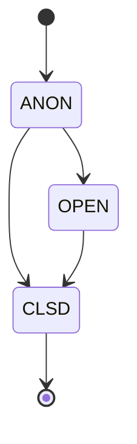
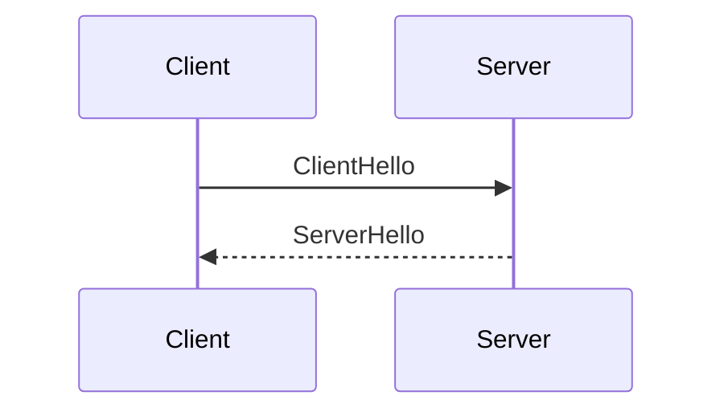
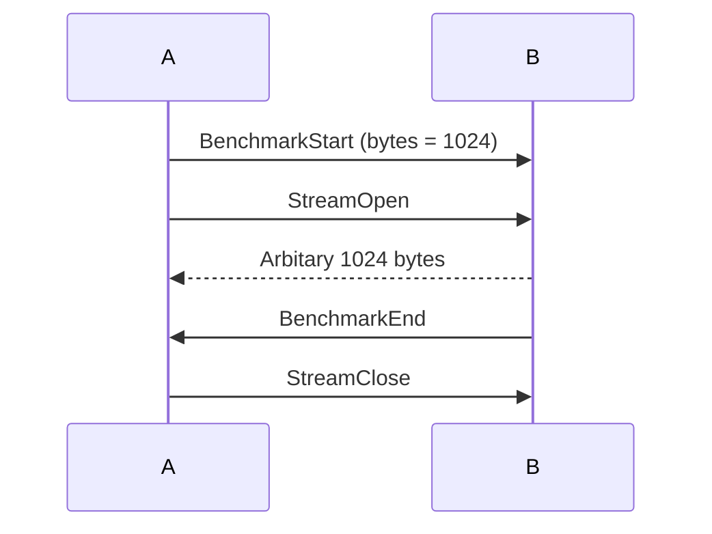

# Protofish

## 크레딧
작성자: MincoMK \
옮김: Ruma, Try \
*Protofish* 라는 저자분께 바칩니다.

## 소개
Protofish 는 다양한 zako2 의 호스트간 스트림과 메시지 전송을 추상화한 전송 계층입니다.
Protofish 자체는, 데이터가 어떻게 흐를지 완전히 명시하는것이 아닌, 다양한 프로토콜에서 Protofish 를 구현하기 위한 설명서에 가깝습니다.

## 특징
Protofish는 다양하고 간단한 필수 기능을 지원합니다. 간략하게 살펴보겠습니다.

### 자율 메시징 (Arbitary Messaging)
Protofish를 사용하면 연결을 통해 다양한 바이너리 데이터를 안전하게 전송할 수 있습니다. 예로,  Protofish 의 메시징 채널을 데이터 요청 전송 등으로 활용할수도 있습니다.

### 손실/무손실 스트리밍
Protofish는 손실 바이너리 스트리밍과 무손실 바이너리 스트리밍을 모두 지원합니다. 스트림이 열려 있음을 알리는 메시지를 전송하면 새로운 독립 논리 스트림이 시작되어 이를 통해 바이너리 데이터를 전송할 수 있습니다. 예를 들어, 손실 바이너리 스트림을 활용하여 라이브 오디오 스트림을 전송할 수 있습니다.

Protofish는 손실 바이너리 스트리밍과 무손실 바이너리 스트리밍을 모두 지원합니다. 새로운 스트림이 열림을 알리는 메시지를 전송하면 논리적으로 분리된 새로운 스트림이 시작되고, 스트림을 통해 오디오 스트림 등등 원하는 바이너리 데이터를 전송할수 있습니다.

### 컨텍스트 추적
Protofish를 사용하면 요청을 추적하고 여러 응답을 쉽게 처리할 수 있습니다.

# 기본 개념
Protofish의 기본 개념과 관련된 문단입니다.

## 메시지와 페이로드 - Message, Payload
메시지와 페이로드는 밀접한 관련이 있는 개념입니다. REST API와 유사하며, 이벤트, 단순 데이터 전달, 통신에 사용됩니다.

### Payload - 페이로드
페이로드는 REST 엔드포인트의 스키마와 비슷한 개념입니다. 각각의 페이로드는 전달하고자 하는 명령과 해당 명령에 필요한 인자를 구조화된 형식으로 가집니다. 짧게 말해, 상대에게 특정 작업을 수행하도록 하는 일종의 명령입니다. 예를 들어, 새로운 스트림을 열것임을 의미하는 `StreamOpen` 과 닫을것임을 의미하는 `StreamClose` 등이 있습니다.

### Message - 메시지
메시지는 페이로드를 담기위한 봉투같은 느낌입니다. 메시지에는 한 종류의 페이로드가 들어갑니다. Protofish 의 메시징 채널로 전달되는 실질적인 직렬화 데이터가 바로 메시지입니다.

> **NOTE** 메시지와 페이로드를 구분하는게 다소 햇갈릴수 있습니다. 택배를 생각하면 쉽습니다. 페이로드는 택배로 배송할 내용물이고, 메시지는 내용물을 포장하는 박스 정도의 느낌입니다.

## Context System - 컨텍스트 시스템
메시지 채널은 기본적으로 *평면적*입니다. 클라이언트가 여러 메시지를 동시에 보낼수도 있으며, 이 메시지가 저 메시지에 대한 응답인지 기본적으론 구분할수 없습니다. 서버가 A 요청을 보내면 A 의 응답을 구분하여 받고 싶겠지만, 상술했듯 채널은 *평면적*이기에 A 요청 바로 다음 메시지가 A 의 응답일거란 보장은 없습니다.

때문에 컨텍스트 시스템이 필요합니다. 컨텍스트는 각각의 요청에 대한 매니저 정도의 개념이며, A 요청을 보내자 마자, A 요청만을 위한 새로운 컨텍스트가 생성됩니다. 모든 메시지에는 이게 어느 컨텍스트에 해당하는지 표기되며, 메시지에 표기된 컨텍스트를 통해 A 요청의 응답을 추적하고 구분할수 있습니다.

또한 컨텍스트 ID 는 중복될수 없고 고유합니다.

## Stream Management - 스트림 관리
Protofish can easily manage multiple parallel binary streams. Streams are identified by their ID. `StreamOpen` and `StreamClose` messages notify the peer the open and close of the stream, respectively. Since they are messages, they also have the ability to track contexts. Therefore, a binary stream can be a response to a request.

Protofish 는 병렬로 동작하는 여러개의 바이너리 스트림을 손쉽게 관리할수 있습니다. 각 스트림은 고유한 ID 로 구분됩니다. 각 스트림의 생성과 해체는 `StreamOpen` 과 `StreamClose` 메세지를 통해 상대방에게 알립니다. 
그리고 `StreamOpen`, `StreamClose` 또한 메시지이기에, 컨텍스트 시스템이 적용되며, `StreamOpen` 이 다른 요청에 대한 응답으로써 기능할수도 있습니다

## 통신 예외처리
Protofish 는 통신 장애에서도 연결 유지 & 재개 매커니즘이 존재합니다. 연결이 끊어지더라도, 모든 스트림을 빠르게 재개할수 있습니다.

## Benchmarking - 벤치마킹
Based on the experience gained with HTTP/WS, we've learned that benchmark monitoring is a crucial part of achieving reduced latency. So Protofish now has the ability to automatically perform various benchmark tests to assess the performance.

이전에 HTTP/WS 관련 프로젝트를 통해 얻은 경험에서 기인한 바, 벤치마크 모니터링이 지연시간 단축에 매우 중요하게 작용합니다. Protofish 는 다양한 벤치마크 테스트를 자동으루 수행하여, 성능을 평가하고, 지연시간 단축에 이를 활용할수 있습니다.

# 명세

> **NOTE** 이 문서에서 "MUST", "MUST NOT", "REQUIRED", "SHALL", "SHALL NOT", "SHOULD", "SHOULD NOT", "RECOMMENDED", "MAY", "OPTIONAL" 과 같은 핵심 단어는 RFC2119 에 기인하였으며 이에 맞춰 해석해야 합니다.

## 버전 관리
Protofish's version system follows [Semantic Versioning](https://semver.org). Also, it follows [Keep a Changelog](https://keepachangelog.com/en/1.1.0/) rule.

* Protofish 의 버전 관리 시스템은 [Semantic Versioning](https://semver.org) 을 따릅니다.
* Protofish 의 로그 유지 관리는 [Keep a Changelog](https://keepachangelog.com/en/1.1.0/) 를 따릅니다.

## 상위 프로토콜
Protofish 는 상위 프로토콜에 의존하며, 특정 프로토콜을 Protofish 의 구현에 사용하기 위해선 몇가지 요구사항을 확인해야 합니다.
- **안정성** 모든 스트림에 대해 완전한 바이너리 무결성이 보장되어야만 **한다**.
- **비차단** 특정 스트림은 타 스트림을 방해하거나 막아선 **안된다**.
- **멀티스트림** 여러개의 안정적인 독립 스트림을 위하여 아래 사항을 충족하야 **한다**.
    - 안정적인 스트림을 제공해야 **하며**, 분리된 스트림을 생성할수 있는 인터페이스가 제공되어야 **한다**.
    - 새로운 스트림이 생성되었다는 것을 반대편에 알리는 메커니즘이 반드시 있어야 **한다**.
    - 각 스트림을 ID 로 구분할 방법이 반드시 있어야 **한다**.

### 기본 스트림
상위 프로토콜에서 처음으로 생성된 스트림은 기본 스트림 (aka. 메시지 스트림) 으로 사용되며 Protofish 의 모든 메세지 처리는 이 기본 스트림에 의존합니다. 때문에 기본 스트림은 반드시 신뢰할수 있는 무손실 스트림이여야 **합니다**.

## The Standard
Protofish is designed to support adaptation to a wide range of upstream protocols. However, the recommended implementation setup is QUIC-based upstream protocol, which is specially specified as [QUICfish](quicfish.md).

## Summary of Operation
Protofish follows simple operational rules.

### Protofish Finite State Machine (FSM)
This section describes the Protofish operation in terms of a Finite State Machine (FSM).

#### States
Protofish has multiple types of states. This state model is for conceptual representation of Protofish. Therefore, it's not neccesary to exactly follow the model as far as the implementations support the described functionality.



##### ANON
|From|To|Reason|
|-|-|-|
|x|**ANON**|Initial connection|
|**ANON**|**OPEN**|Handshake|
|**ANON**|**CLSD**|Close Packet|
**ANON** (Anonymous) is the initial state of every connection. It doesn't contain any peer info.

##### OPEN
|From|To|Reason|
|-|-|-|
|**ANON**|**OPEN**|Handshake|
|**OPEN**|**CLSD**|Close Packet|
Once the handshake procedure in **ANON** state has been successfully done, it becomes **OPEN**. **OPEN** state contains all session variables, connection info, etc.

##### CLSD
|From|To|Reason|
|-|-|-|
|**ANON**|**CLSD**|Close Packet|
|**OPEN**|**CLSD**|Close Packet|
**CLSD** is the pseudo-state that represents a closed connection. The implementation SHOULD store the CLSD connection handle for an appropriate time to achieve stable resuming if needed.

#### Session Variables
**OPEN** state forms a session. Session MUST store these variables.
- **Connection Token** The connection token acquired from `ServerHello`
- **Context Information** Map from context ID to the list of open stream IDs in the context

## Primary Messaging Channel (PMC)
Primary stream MUST be used for messaging. Messages MUST follow the [framing rules](#framing) to frame the binary content. Only payloads SHOULD transferred through PMC.

### Payload
All [payload](#payload)s are defined at [payloads.proto](protos/payload/payloads.proto).

Following list is the payloads and their explanations.
- **ClientHello** A packet that initializes a handshake
- **ServerHello** A packet that responses to the ClientHello
- **Close** A packet to close the connection
- **OK** Represents the request in the context has been succeeded
- **Error** Represents the request in the context has been failed
- **StreamOpen** A packet that opens a new stream
- **StreamClose** A packet that destroys the existing stream
- **ArbitaryData** A packet to pass any downstream binary message
- **Keepalive** A packet that pings the peer
- **BenchmarkStart** A packet that starts a benchmark
- **BenchmarkEnd** A packet that indicates the end of a benchmark.

### Message
All payloads going through PMC MUST be serialized with the `Message` specification in [message.proto](protos/payload/message.proto). Field `context_id` indicates a context ID, therefore it MUST unique. It is RECOMMENDED to use a simple atomic counter to resolve a next context ID.

### Framing
Message channel is streamed via length delimited frame.
```
[ Length (uint64, Little Endian) | Message (binary) ]
```

## Handshake Flow

Protofish uses a common handshake procedure to exchange the informations between a server and a client. It's done in the PMC via messages. Handshake messages MUST belong in context with ID 0, and context with ID 0 SHOULD NOT used for other purpose.

### Client-side Hello
Once an upstream connection is established, a client MUST send `ClientHello` to a server.

### Server-side Hello
Once a server received `ClientHello`, it MUST immediately respond with `ServerHello`. Field `ok` in `ServerHello` MUST be *true* to indicate a successful handshake and continue. It MUST be `false` to indicate a rejection. Payload `Error` MAY follow the rejected `ServerHello`. Field `info` in `ServerHello` must exist if `ok` is *true*.

### State Transition
Once after a successful handshake, both peers SHOULD have a transition to **OPEN** state.

## Closing
Connection SHOULD be closed in following reason.
- **Close Packet** Message `Close` can be sent in order to gracefully close the connection. Both peers MAY erase the state information after a close packet. Gracefully closed connection cannot be resumed.
- **Keepalive Timeout** Keepalive timeout SHOULD be considerd as connection close.

## Resume Connection
### Connection Token
Server MUST provide a unique connection token in a successful `ServerHello`. A connection token SHOULD be a random 32 bytes long data.

### Behavior
Server with accidently closed connection MAY store the client handle with **CLSD** state for a desired time, which is RECOMMENDED to be 15 minutes. Client with accidently closed connection MAY try to reconnect and resume. Resume operation MUST be done by setting a field `resume_connection_token` to the connection token acquired by `ServerHello` in a previous conenction. Server SHOULD revert the **CLSD** state of a resumed client to **OPEN**, and continue transmission.

Server MUST set field `is_resume` under `ServerHello` to indicate that it successfully restored stream information and ready to resume the connection. Client SHOULD resume the connection and continue to stream only if `is_resume` is *true*.

## Keepaliving
Both side MAY send a `Keepalive` message to check a liveness of the peer. Peer MUST immediately send `OK` message to the context of the received `Keepalive` message. Both side MAY choose the frequency of sending a `Keepalive` message and a wait timeout for `OK` message to consider the peer as down. Although it's free to set their own values, but the following is a RECOMMENDED standard.
- Send `Keepalive` every 30 seconds.
- Timeout after waiting 2 seconds.

## Benchmarking
One side, call side A, MAY send `BenchmarkStart` message to start measuring bandwidth. `StreamOpen` SHOULD follow by the side A in the context. The peer B SHOULD send arbitary bytes with a count specified in the field `byte_count` in the `BenchmarkStart` message. Therefore it's possible to measure the bandwidth by measuring the time elapsed. The side B SHOULD send `BenchmarkEnd` in the context after all bytes were sent. And the side A SHOULD close the stream by sending `StreamClose`.

Also, benchmark SHOULD be interrupted if early `StreamClose` is received.

## Error Handling
Both sides SHOULD send `Error` message to notify the peer that an error has been occurred. Also, `Close` message MAY followed to close the connection due to a critial error.

## Security Considerations
A native Protofish implementation is abstract. Therefore it has no need to implement security features. However, upstream protocol MAY support modern authentication system like mTLS.

# Conclusion
This document comprehensively explained the operation of a simple protocol, Protofish.


asdfasdf