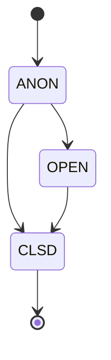
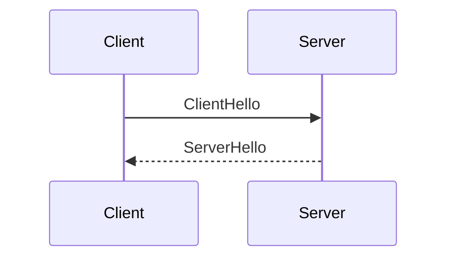
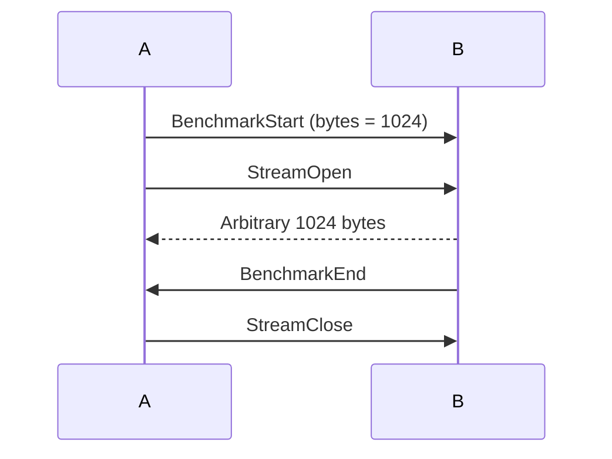

# Protofish

## Credits

작성: MincomK\
옮김: Ruma, Try, Nyani \
Dedicated to the one who is an author of the name *Protofish*.


**문서 기준:** 본 문서는 [zako-ac/protofish](https://github.com/zako-ac/protofish) 저장소의 다음 커밋을 기준으로 작성되었습니다:
- `3e8a474` (pnyani, 2025): docs: fix typos and grammar errors in protofish.md
- `fa55f4c` (mincomk, 2025): Merge pull request #23 from pnyani/fix-typos-issue-21

*이후 원본 문서가 업데이트될 수 있으니, 최신 버전은 공식 저장소를 참조하시기 바랍니다.*

## 소개
Protofish는 다양한 Zako2 컴포넌트 간 스트림과 메시지의 전송을 추상화하는 중간 전송 계층입니다. Protofish 자체는 데이터 흐름의 전체 과정을 명시하지 않으며, 임의의 업스트림 프로토콜 위에서 Protofish를 구현하기 위한 가이드라인을 제공합니다.

## 목차
  * [기능](#features)
    + [임의 메시징](#arbitrary-messaging)
    + [손실/무손실 스트리밍](#lossylossless-streaming)
    + [컨텍스트 추적](#context-tracking)
- [기본 작동 개념](#basic-operational-concept)
  * [메시지와 페이로드](#messages-and-payloads)
  * [컨텍스트 시스템](#context-system)
  * [스트림 관리](#stream-management)
  * [장애 허용](#fault-tolerance)
  * [벤치마킹](#benchmarking)
- [명세](#specification)
  * [요구사항 명세](#specifications-of-requirements)
  * [버전 관리](#version-management)
  * [업스트림 전송 프로토콜 (UTP)](#upstream-transport-protocol-utp)
    + [스트림 열기](#stream-open)
      - [매개변수](#parameters)
      - [반환값](#returns)
    + [스트림 닫기](#stream-close)
      - [매개변수](#parameters-1)
    + [전송](#send)
      - [매개변수](#parameters-2)
    + [수신](#receive)
      - [매개변수](#parameters-3)
      - [반환값](#returns-1)
    + [주 스트림](#primary-stream)
  * [표준](#the-standard)
  * [작동 요약](#summary-of-operation)
    + [Protofish 유한 상태 기계 (FSM)](#protofish-finite-state-machine-fsm)
      - [상태](#states)
        * [ANON](#anon)
        * [OPEN](#open)
        * [CLSD](#clsd)
      - [세션 변수](#session-variables)
  * [주 메시징 채널 (PMC)](#primary-messaging-channel-pmc)
    + [페이로드](#payload)
    + [메시지](#message)
    + [프레이밍](#framing)
  * [컨텍스트 ID 풀링](#context-id-pooling)
    + [컨텍스트 ID 패리티 규칙](#context-id-parity-rules)
  * [핸드셰이크 흐름](#handshake-flow)
    + [클라이언트 측 Hello](#client-side-hello)
    + [서버 측 Hello](#server-side-hello)
    + [상태 전이](#state-transition)
  * [종료](#closing)
  * [연결 재개](#resume-connection)
    + [연결 토큰](#connection-token)
    + [동작](#behavior)
  * [Keepalive](#keepaliving)
  * [벤치마킹](#benchmarking-1)
  * [오류 처리](#error-handling)
  * [보안 고려사항](#security-considerations)
- [결론](#conclusion)

<!-- tocstop -->

## 기능
Protofish는 여러 가지 필수 기능을 지원합니다. 이를 간략하게 살펴보겠습니다.

### 임의 메시징
Protofish는 연결을 통한 바이너리 데이터의 안전한 전송을 가능하게 합니다. 예를 들어, 데이터 요청을 Protofish 메시징 채널을 통해 전송할 수 있습니다.

### 손실/무손실 스트리밍
Protofish는 손실과 무손실 바이너리 스트리밍을 모두 지원합니다. 스트림 개방을 알리는 메시지가 전송되면, 독립적인 논리적 스트림이 시작됩니다. 이를 통해 바이너리 데이터를 해당 스트림을 통해 전송할 수 있습니다. 예를 들어, 손실 바이너리 스트림을 활용하여 라이브 오디오를 전송할 수 있습니다.

### 컨텍스트 추적
Protofish는 요청과 해당 응답을 추적하기 위해 컨텍스트 추적 메커니즘을 활용합니다. 이는 요청과 응답을 쌍으로 연결하는 기존 방식에서 벗어나, 동적 행동 능력을 제한하지 않으며 통신에서 대화형 패턴을 가능하게 합니다.

# 기본 작동 개념
이 장에서는 Protofish의 기본 작동 개념을 다룹니다.

## 메시지와 페이로드
페이로드는 전송되는 정보의 구조를 정의하며, 명령, 이벤트 또는 데이터가 될 수 있습니다. 메시지는 페이로드를 컨텍스트 정보와 함께 캡슐화합니다. 메시지는 페이로드의 봉투로서, 단일 페이로드를 컨텍스트 ID와 함께 포장하며, 이 컨텍스트 ID는 메시지의 우편번호 역할을 합니다.

> **참고** 메시지와 페이로드의 개념을 구분하는 것은 혼란스러울 수 있습니다. 페이로드를 제품으로, 메시지를 배송 전에 제품을 우편번호와 함께 담는 골판지 상자로 생각하면 직관적으로 이해할 수 있습니다.

## 컨텍스트 시스템
기본적으로 메시지 채널은 평면적입니다. 서버와 클라이언트는 동시에 여러 주제로 통신할 수 있습니다. 컨텍스트는 메시지의 엄격한 그룹화와 순서를 보장합니다.\
방법론적으로, 모든 메시지는 고유한 컨텍스트 ID로 표시됩니다. 이를 통해 페이로드가 컨텍스트를 인식하게 됩니다.

## 스트림 관리
Protofish는 ID로 식별되는 여러 병렬 바이너리 스트림을 쉽게 관리할 수 있습니다. `StreamOpen`과 `StreamClose` 메시지는 각각 스트림의 개방과 종료를 상대 피어에게 알립니다. 이들은 메시지이기 때문에 컨텍스트를 추적하는 기능도 가지고 있습니다. 따라서 바이너리 스트림은 요청에 대한 응답이 될 수 있습니다.

## 장애 허용
Protofish는 장애 허용을 위해 *keepalive*와 *연결 재개* 메커니즘을 제공합니다. 연결이 끊어진 후 모든 스트림을 신속하게 재개할 수 있습니다.

## 벤치마킹
HTTP/WS를 사용하면서 얻은 경험을 바탕으로, 벤치마크 모니터링이 지연 시간 감소를 달성하는 데 중요한 부분임을 배웠습니다. 따라서 Protofish는 이제 성능을 평가하기 위해 다양한 벤치마크 테스트를 자동으로 수행할 수 있는 기능을 갖추고 있습니다.

# 명세

## 요구사항 명세
이 문서에서 "MUST", "MUST NOT", "REQUIRED", "SHALL", "SHALL NOT", "SHOULD", "SHOULD NOT", "RECOMMENDED", "MAY", "OPTIONAL" 키워드는 [RFC2119](https://datatracker.ietf.org/doc/html/rfc2119)에 설명된 대로 해석되어야 합니다.

## 버전 관리
Protofish의 버전 시스템은 [Semantic Versioning](https://semver.org)을 따릅니다. 또한 [Keep a Changelog](https://keepachangelog.com/en/1.1.0/) 규칙을 따릅니다.

## 업스트림 전송 프로토콜 (UTP)
Protofish는 전적으로 UTP에 의존합니다. 따라서 UTP에 엄격한 전제 조건이 적용됩니다. 다음은 전제 조건 목록입니다:

- **안정성** 모든 신뢰성 스트림에 대해 완전한 바이너리 무결성을 반드시 보장해야 합니다 (MUST).
- **논블로킹** 스트림은 다른 스트림을 차단하거나 간섭해서는 안 됩니다 (SHOULD NOT).
- **다중화** 반드시 다음 조건을 따라야 합니다 (MUST):
    - 신뢰성 스트림을 제공해야 하며, 원하는 수만큼 격리된 스트림을 생성할 수 있는 인터페이스도 반드시 제공해야 합니다 (MUST).
    - 새 스트림이 생성되었음을 상대방에게 알리는 메커니즘이 반드시 있어야 합니다 (MUST).
    - 스트림의 신뢰성 여부와 관계없이 ID로 스트림을 구별할 수 있는 방법이 반드시 있어야 합니다 (MUST).

기능 관점에서 UTP는 다음 작업을 지원하는 것이 권장됩니다 (SHOULD):

### 스트림 열기
#### 매개변수
- **Reliability** 스트림이 신뢰성 스트림인지 여부

#### 반환값
- **ID** 내부적으로 스트림을 식별하는 방법

### 스트림 닫기
#### 매개변수
- **ID** 닫을 스트림의 식별자

### 전송
#### 매개변수
- **ID** 전송할 스트림의 식별자
- **Data** 전송할 바이너리 데이터

### 수신
#### 매개변수
- **ID** 수신할 스트림의 식별자

#### 반환값
- **Data** 수신된 바이너리 콘텐츠

### 주 스트림
UTP의 첫 번째 스트림은 반드시 **주 스트림**이라고 불리는 신뢰성 스트림이어야 합니다 (MUST). Protofish는 모든 프로토콜 메시지를 전송하기 위해 주 스트림에 전적으로 의존합니다.

## 표준
Protofish는 광범위한 UTP에 대한 적응을 지원하도록 설계되었습니다. 그러나 권장되는 구현 설정은 [QUICfish](quicfish.md)로 특별히 명시된 QUIC 기반 UTP를 사용하는 것입니다.

## 작동 요약
Protofish는 다음과 같은 간단한 작동 규칙을 따릅니다.

### Protofish 유한 상태 기계 (FSM)
이 섹션에서는 유한 상태 기계 관점에서 Protofish 작동을 설명합니다.

#### 상태
Protofish는 여러 유형의 상태를 가지고 있습니다. 이 상태 모델은 Protofish의 개념적 표현을 위한 것입니다. 따라서 구현이 설명된 기능을 지원하는 한 모델을 정확히 따를 필요는 없습니다.



##### ANON
|From|To|Reason|
|-|-|-|
|x|**ANON**|초기 연결|
|**ANON**|**OPEN**|핸드셰이크|
|**ANON**|**CLSD**|Close 패킷|

**ANON**은 모든 연결의 초기 상태입니다. 피어 정보를 포함하지 않습니다.

##### OPEN
|From|To|Reason|
|-|-|-|
|**ANON**|**OPEN**|핸드셰이크|
|**OPEN**|**CLSD**|Close 패킷|

**ANON** 상태에서 핸드셰이크 절차가 성공적으로 완료되면 **OPEN** 상태가 됩니다. **OPEN** 상태는 모든 세션 변수, 컨텍스트 정보 등을 포함합니다.

##### CLSD
|From|To|Reason|
|-|-|-|
|**ANON**|**CLSD**|Close 패킷|
|**OPEN**|**CLSD**|Close 패킷|

**CLSD**는 닫힌 연결을 나타내는 의사 상태입니다. 구현은 필요한 경우 안정적인 재개를 달성하기 위해 적절한 시간 동안 CLSD 연결 핸들을 저장하는 것이 권장됩니다 (SHOULD).

#### 세션 변수
**OPEN** 상태는 세션을 형성합니다. 세션은 반드시 다음 변수를 저장해야 합니다 (MUST):
- **연결 토큰** `ServerHello`에서 획득한 연결 토큰
- **컨텍스트 정보** 컨텍스트 ID에서 해당 컨텍스트 내 열린 스트림 ID 목록으로의 매핑

## 주 메시징 채널 (PMC)
주 스트림은 반드시 메시징에만 사용되어야 합니다 (MUST). 메시지는 바이너리 콘텐츠를 프레임화하기 위해 반드시 [프레이밍 규칙](#framing)을 따라야 합니다 (MUST). 페이로드만 PMC를 통해 전송되는 것이 권장됩니다 (SHOULD).

### 페이로드
모든 페이로드는 [payloads.proto](protos/payload/payloads.proto)에 정의되어 있습니다.

다음은 페이로드와 그 설명 목록입니다:
- **ClientHello** 핸드셰이크를 시작하는 패킷
- **ServerHello** ClientHello에 응답하는 패킷
- **Close** 연결을 닫는 패킷
- **OK** 컨텍스트 내 요청이 성공했음을 나타냄
- **Error** 컨텍스트 내 요청이 실패했음을 나타냄
- **StreamOpen** 새 스트림을 여는 패킷
- **StreamClose** 기존 스트림을 종료하는 패킷
- **ArbitraryData** 다운스트림 바이너리 메시지를 전달하는 패킷
- **Keepalive** 피어에게 핑을 보내는 패킷
- **BenchmarkStart** 벤치마크를 시작하는 패킷
- **BenchmarkEnd** 벤치마크의 종료를 나타내는 패킷

### 메시지
PMC를 통과하는 모든 페이로드는 반드시 [message.proto](protos/payload/message.proto)의 `Message` 명세로 직렬화되어야 합니다 (MUST). `context_id` 필드는 컨텍스트 ID를 나타내므로 반드시 고유해야 합니다 (MUST). 다음 컨텍스트 ID를 해결하기 위해 간단한 원자적 카운터를 사용하는 것이 권장됩니다 (RECOMMENDED).

### 프레이밍
메시지 채널은 리틀 엔디안 64비트 길이 구분 프레이밍 규칙을 통해 스트리밍됩니다.
```
[ Length (uint64, Little Endian) | Message (binary) ]
```

## 컨텍스트 ID 풀링
서버와 클라이언트는 컨텍스트 ID를 저장하기 위한 카운터를 유지하는 것이 권장됩니다 (SHOULD). 이들 간의 컨텍스트 ID 충돌을 해결하기 위해, 컨텍스트 ID의 LSB(최하위 비트)를 예약하여 *컨텍스트 내 초기 메시지의 방향*을 나타냅니다.

### 컨텍스트 ID 패리티 규칙
|LSB|방향|
|-|-|
|`0` (짝수)|클라이언트 &rarr; 서버|
|`1` (홀수)|서버 &rarr; 클라이언트|

또한, 컨텍스트 ID `0`은 핸드셰이킹을 위해 예약되어 있습니다. 핸드셰이크의 초기 메시지인 `ClientHello`는 클라이언트 &rarr; 서버이므로 패리티 규칙을 만족합니다. 드물지만 ID 카운터가 `UINT64_MAX`를 초과하는 경우, 카운터를 기본 값(서버는 `1`, 클라이언트는 `2`)으로 재설정하는 것이 일반적으로 안전합니다.

> **참고** 클라이언트 카운터의 기본값은 `2`입니다. 첫 번째 짝수인 `0`은 핸드셰이크를 위해 예약되어 있기 때문입니다.

## 핸드셰이크 흐름


Protofish는 서버와 클라이언트 간에 정보를 교환하기 위해 일반적인 핸드셰이크 절차를 사용합니다. 이는 메시지를 통해 PMC에서 수행됩니다. 핸드셰이크 메시지는 반드시 ID 0인 컨텍스트에 속해야 하며 (MUST), ID 0인 컨텍스트는 다른 목적으로 사용되어서는 안 됩니다 (SHOULD NOT).

### 클라이언트 측 Hello
업스트림 연결이 설정되면 클라이언트는 반드시 서버에 `ClientHello`를 전송해야 합니다 (MUST).

### 서버 측 Hello
서버가 `ClientHello`를 받으면 반드시 즉시 `ServerHello`로 응답해야 합니다 (MUST). `ServerHello`의 `ok` 필드는 성공적인 핸드셰이크를 나타내고 계속하려면 반드시 *true*여야 합니다 (MUST). `ServerHello`의 `connection_token` 필드는 `ok`가 *true*인 경우 반드시 존재해야 합니다 (MUST). 그렇지 않으면 거부를 나타내기 위해 반드시 *false*여야 합니다 (MUST). 거부된 `ServerHello`가 있는 연결은 닫힐 수 있습니다 (MAY). 또한, `ok`가 *false*인 경우 `message` 필드가 반드시 존재해야 합니다 (MUST).

### 상태 전이
성공적인 핸드셰이크 후, 양쪽 피어는 **OPEN** 상태로 전이하는 것이 권장됩니다 (SHOULD).

## 종료
연결은 다음 이유 중 하나로 닫히는 것이 권장됩니다 (SHOULD):
- **Close 메시지** 연결을 정상적으로 닫기 위해 `Close` 메시지를 전송할 수 있습니다 (MAY). 양쪽 피어는 close 메시지 후 상태 정보를 삭제할 수 있습니다 (MAY). 정상적으로 닫힌 연결은 재개할 수 없습니다.
- **Keepalive 타임아웃** Keepalive 타임아웃은 연결 종료로 간주되는 것이 권장됩니다 (SHOULD).

## 연결 재개

### 연결 토큰
서버는 성공적인 `ServerHello`에서 반드시 고유한 연결 토큰을 제공해야 합니다 (MUST). 연결 토큰은 32바이트 길이의 무작위 데이터인 것이 권장됩니다 (SHOULD).

> **보안** 연결 토큰은 재개를 위해 사용됩니다. 연결 토큰은 서버에 대한 단일 신뢰 소스이므로 활성 연결을 하이재킹하는 데 악용될 수 있습니다. 따라서 연결 토큰을 생성하기 위해 암호학적으로 안전한 RNG 방법을 사용하는 것이 강력히 권장됩니다 (RECOMMENDED).

### 동작
우발적으로 닫힌 연결이 있는 서버는 원하는 시간(15분을 권장) 동안 **CLSD** 상태로 클라이언트 핸들을 저장할 수 있습니다 (MAY). 우발적으로 닫힌 연결이 있는 클라이언트는 다시 연결하고 재개를 시도할 수 있습니다 (MAY). 재개 작업은 반드시 이전 연결의 `ServerHello`에서 획득한 연결 토큰으로 `resume_connection_token` 필드를 설정하여 수행되어야 합니다 (MUST). 서버는 재개된 클라이언트의 **CLSD** 상태를 **OPEN**으로 되돌리고 전송을 계속하는 것이 권장됩니다 (SHOULD).

서버는 연결 토큰을 식별하지 못한 `resume_connection_token`이 있는 핸드셰이크를 반드시 거부해야 합니다 (MUST).

## Keepalive
양쪽 모두 피어의 활성 상태를 확인하기 위해 `Keepalive` 메시지를 보낼 수 있습니다 (MAY). 피어는 수신한 `Keepalive` 메시지의 컨텍스트에 반드시 즉시 `OK` 메시지를 보내야 합니다 (MUST). 양쪽 모두 `Keepalive` 메시지를 보내는 빈도와 피어가 다운된 것으로 간주하기 위한 `OK` 메시지 대기 타임아웃을 선택할 수 있습니다 (MAY). 자체 값을 자유롭게 설정할 수 있지만, 다음이 권장 표준입니다 (RECOMMENDED):
- 30초마다 `Keepalive` 전송
- 2초 대기 후 타임아웃

## 벤치마킹
한쪽(측면 A라고 부름)은 대역폭 측정을 시작하기 위해 `BenchmarkStart` 메시지를 보낼 수 있습니다 (MAY). 측면 A는 컨텍스트에서 `StreamOpen`을 따라야 합니다 (SHOULD). 피어 B는 `BenchmarkStart` 메시지의 `byte_count` 필드에 지정된 수만큼의 임의 바이트를 전송하는 것이 권장됩니다 (SHOULD). 따라서 경과 시간을 측정하여 대역폭을 측정할 수 있습니다. 측면 B는 모든 바이트가 전송된 후 컨텍스트에서 `BenchmarkEnd`를 전송하는 것이 권장됩니다 (SHOULD). 그리고 측면 A는 `StreamClose`를 전송하여 스트림을 닫는 것이 권장됩니다 (SHOULD).



또한, 조기 `StreamClose`가 수신되면 벤치마크가 중단되는 것이 권장됩니다 (SHOULD).

## 오류 처리
양쪽 모두 오류가 발생했음을 피어에게 알리기 위해 `Error` 메시지를 전송하는 것이 권장됩니다 (SHOULD). 또한, 심각한 오류로 인해 연결을 닫기 위해 `Close` 메시지가 뒤따를 수 있습니다 (MAY).

## 보안 고려사항
네이티브 Protofish 구현은 추상적입니다. 따라서 보안 기능을 구현할 필요가 없습니다. 그러나 UTP는 mTLS와 같은 최신 인증 시스템을 지원할 수 있습니다 (MAY).

# 결론
이 문서는 간단한 프로토콜인 Protofish의 작동을 포괄적으로 설명했습니다.

ㅁㄴㅇㄹㅁㄴㅇㄹ