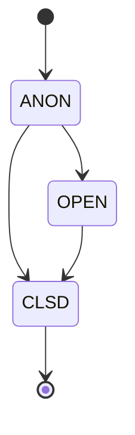
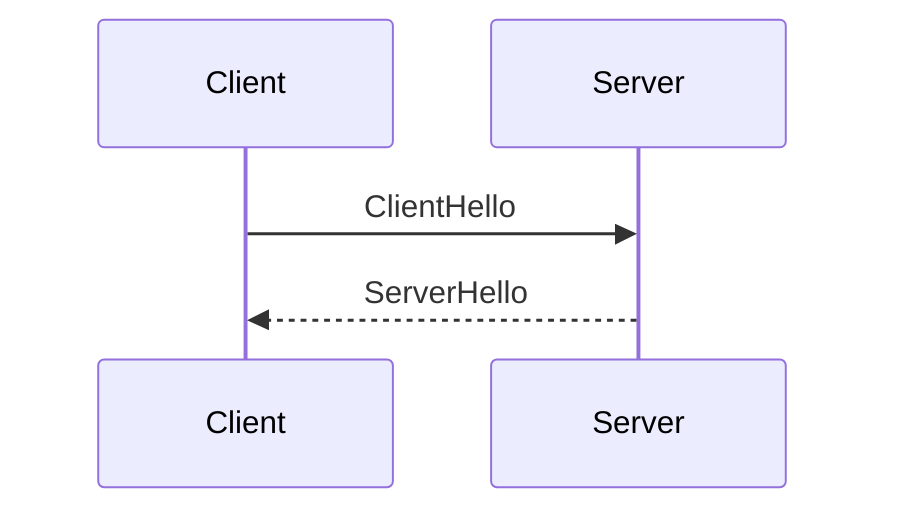
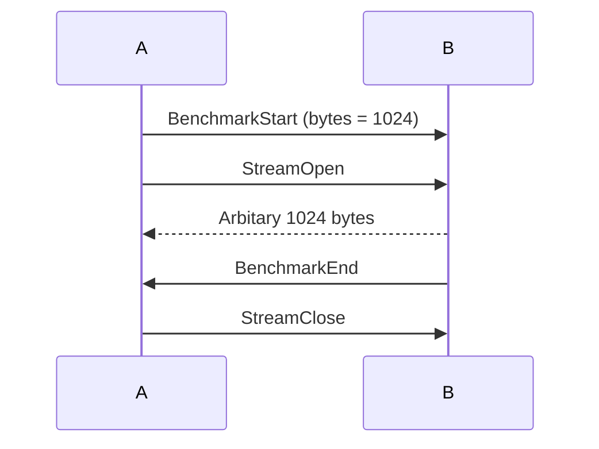

# Protofish

## Credits
Written by MincoMK\
Dedicated to the one who is an author of the name *Protofish*.

## Introduction
Protofish is an intermediate transport layer that abstracts transportation of streams and messages between various Zako2 components. Protofish itself does not specify the whole process of the flow of data, but a guideline to implement Protofish over any upstream protocol.

## Table of Contents
  * [Features](#features)
    + [Arbitary Messaging](#arbitary-messaging)
    + [Lossy/Loseless Streaming](#lossyloseless-streaming)
    + [Context Tracking](#context-tracking)
- [Basic Operational Concept](#basic-operational-concept)
  * [Messages and Payloads](#messages-and-payloads)
  * [Context System](#context-system)
  * [Stream Management](#stream-management)
  * [Fault-Tolerance](#fault-tolerance)
  * [Benchmarking](#benchmarking)
- [Specification](#specification)
  * [Specifications of Requirements](#specifications-of-requirements)
  * [Version Management](#version-management)
  * [Upstream Transport Protocol (UTP)](#upstream-transport-protocol-utp)
    + [Stream Open](#stream-open)
      - [Parameters](#parameters)
      - [Returns](#returns)
    + [Stream Close](#stream-close)
      - [Parameters](#parameters-1)
    + [Send](#send)
      - [Parameters](#parameters-2)
    + [Receive](#receive)
      - [Parameters](#parameters-3)
      - [Returns](#returns-1)
    + [Primary Stream](#primary-stream)
  * [The Standard](#the-standard)
  * [Summary of Operation](#summary-of-operation)
    + [Protofish Finite State Machine (FSM)](#protofish-finite-state-machine-fsm)
      - [States](#states)
        * [ANON](#anon)
        * [OPEN](#open)
        * [CLSD](#clsd)
      - [Session Variables](#session-variables)
  * [Primary Messaging Channel (PMC)](#primary-messaging-channel-pmc)
    + [Payload](#payload)
    + [Message](#message)
    + [Framing](#framing)
  * [Context ID Pooling](#context-id-pooling)
    + [Context ID Parity Rules](#context-id-parity-rules)
  * [Handshake Flow](#handshake-flow)
    + [Client-side Hello](#client-side-hello)
    + [Server-side Hello](#server-side-hello)
    + [State Transition](#state-transition)
  * [Closing](#closing)
  * [Resume Connection](#resume-connection)
    + [Connection Token](#connection-token)
    + [Behavior](#behavior)
  * [Keepaliving](#keepaliving)
  * [Benchmarking](#benchmarking-1)
  * [Error Handling](#error-handling)
  * [Security Considerations](#security-considerations)
- [Conclusion](#conclusion)

<!-- tocstop -->

## Features
Protofish supports several essential features. Let us briefly review them.

### Arbitary Messaging
Protofish enables safe transmission of binary data over a connection. For example, a data request can be sent through the Protofish messaging channel.

### Lossy/Loseless Streaming
Protofish supports both lossy and lossless binary streaming. Once a message notifying an open stream is sent, an independant logical stream is initiated. It allows a binary data to be sent through itself. For example, a lossy binary stream can be utilized to send live audio.

### Context Tracking
Protofish leverages a context tracking mechanism to track request and corresponding responses. It breaks away from the conventional way of pairing a request to a response, which limits the ability to act dynamically, enabling a conversational pattern in communication.

# Basic Operational Concept
In this chapter, we're going to deal with the basic operational concept of Protofish.

## Messages and Payloads
A payload defines the structure of information being transferred, which can be a command, an event, or data. A message encapsulates a payload along with a context information. It's an envelope for the payload that wraps a single payload together with its context ID, which serves as a ZIP code for the message.

> **NOTE** Distuingishing between the concepts of a message and a payload may be confusing. It can be understood intuitively by thinking the payload as a product, and the message as some kind of cardboard box that encloses the product before shipping, together with a ZIP code.

## Context System
Basically, a message channel is *flat*. A server and a client may communicate with multiple topics simultaneously. A context guarantees strict grouping and ordering of the messages.\
Methodologically, every messages are marked with a unique context ID. It makes the payload to be context-aware.

## Stream Management
Protofish can easily manage multiple parallel binary streams, which are identified by their ID. `StreamOpen` and `StreamClose` messages notify the peer opening and closing of the stream, respectively. Since they are messages, they also have the ability to track contexts. Therefore, a binary stream can be a response to a request.

## Fault-Tolerance
Protofish provides you a *keepalive* and a *connection resume* mechanism to be fault-tolerant. It can quickly resume all streams after the connection drop.

## Benchmarking
Based on the experience gained with HTTP/WS, we've learned that benchmark monitoring is a crucial part of achieving reduced latency. So Protofish now has the ability to automatically perform various benchmark tests to assess the performance.

# Specification

## Specifications of Requirements
The key words "MUST", "MUST NOT", "REQUIRED", "SHALL", "SHALL NOT", "SHOULD", "SHOULD NOT", "RECOMMENDED", "MAY", and "OPTIONAL" in this document are to be interpreted as described in [RFC2119](https://datatracker.ietf.org/doc/html/rfc2119).

## Version Management
Protofish's version system follows [Semantic Versioning](https://semver.org). Also, it follows [Keep a Changelog](https://keepachangelog.com/en/1.1.0/) rule.

## Upstream Transport Protocol (UTP)
Protofish entirly relies on UTP. Therefore, strict prerequisites are applied to UTP. Following list is the prerequisites.
- **Stability** It MUST guarantee a full binary integrity for all reliable streams.
- **Non-blocking** The stream SHOULD NOT block nor interfere other streams.
- **Multiplexing** It MUST follow these conditions.
    - It MUST provide a reliable stream, and also an interface to create isolated streams in a desired count.
    - It MUST have a mechanism to notify the other side that a new stream is created.
    - It MUST have a way to distuingish streams by their IDs, regardless of the reliability of a stream.
In a perspective of functionality, UTP SHOULD support these operations:
### Stream Open
#### Parameters
- **Reliability** Whether the stream is reliable or not
#### Returns
- **ID** A method to identify the stream, internally

### Stream Close
#### Parameters
- **ID** An identifier of the stream to close

### Send
#### Parameters
- **ID** An identifier of the stream to send
- **Data** A binary data to send

### Receive
#### Parameters
- **ID** An identifier of the stream to receive
#### Returns
- **Data** A binary content received

### Primary Stream
The very first stream of UTP MUST be a reliable stream, which is called **primary stream**. Protofish entirely relies on the primary stream to transfer all protocol messages.

## The Standard
Protofish is designed to support an adaptation to a wide range of UTPs. However, a recommended implementation setup is using a QUIC-based UTP, which is specially specified as [QUICfish](quicfish.md).

## Summary of Operation
Protofish follows these simple operational rules.

### Protofish Finite State Machine (FSM)
This section describes the Protofish operation in terms of a Finite State Machine (FSM).

#### States
Protofish has multiple types of states. This state model is for a conceptual representation of Protofish. Therefore, it's not neccesary to exactly follow the model as far as the implementations support the described functionality.



##### ANON
|From|To|Reason|
|-|-|-|
|x|**ANON**|Initial connection|
|**ANON**|**OPEN**|Handshake|
|**ANON**|**CLSD**|Close Packet|
**ANON** (Anonymous) is the initial state of every connection. It doesn't contain any peer info.

##### OPEN
|From|To|Reason|
|-|-|-|
|**ANON**|**OPEN**|Handshake|
|**OPEN**|**CLSD**|Close Packet|
Once the handshake procedure in **ANON** state has been successfully done, it becomes **OPEN** state. **OPEN** state contains all session variables, context informations, and so on.

##### CLSD
|From|To|Reason|
|-|-|-|
|**ANON**|**CLSD**|Close Packet|
|**OPEN**|**CLSD**|Close Packet|
**CLSD** is a pseudo-state that represents a closed connection. The implementation SHOULD store a CLSD connection handle for appropriate time to achieve stable resuming if needed.

#### Session Variables
**OPEN** state forms a session. Session MUST store these variables.
- **Connection Token** The connection token acquired from `ServerHello`
- **Context Information** Map from context ID to the list of open stream IDs in the context

## Primary Messaging Channel (PMC)
Primary stream MUST only be used for messaging. Messages MUST follow the [framing rules](#framing) to frame the binary content. Only payloads SHOULD transferred through PMC.

### Payload
All [payload](#payload)s are defined at [payloads.proto](protos/payload/payloads.proto).

Following list is the payloads and their explanations.
- **ClientHello** A packet that initializes a handshake
- **ServerHello** A packet that responses to the ClientHello
- **Close** A packet to close the connection
- **OK** Represents the request in the context has been succeeded
- **Error** Represents the request in the context has been failed
- **StreamOpen** A packet that opens a new stream
- **StreamClose** A packet that destroys the existing stream
- **ArbitaryData** A packet to pass any downstream binary message
- **Keepalive** A packet that pings the peer
- **BenchmarkStart** A packet that starts a benchmark
- **BenchmarkEnd** A packet that indicates the end of a benchmark

### Message
All payloads going through PMC MUST be serialized with the `Message` specification in [message.proto](protos/payload/message.proto). Field `context_id` indicates a context ID, therefore it MUST unique. Using a simple atomic counter to resolve a next context ID is RECOMMENDED.

### Framing
Message channel is streamed through a little endian 64 bit length-delimited framing rule.
```
[ Length (uint64, Little Endian) | Message (binary) ]
```

## Context ID Pooling
A server and a client SHOULD maintain a counter to store a context ID. To resolve a context ID conflict between them, we reserve the LSB of a context ID to indicate a *direction of the initial message within a context*.
### Context ID Parity Rules
|LSB|Direction|
|-|-|
|`0` (Even)|Client &rarr; Server|
|`1` (Odd)|Server &rarr; Client|

Also, context ID `0` is reserved for handshaking. A initial message of a handshake, `ClientHello`, which is Client &rarr; Server, does satisfy the parity rules. Although it would be rare, if the ID counter exceeds `UINT64_MAX`, it is generally safe to reset the counter to a base value (`1` for a server, `2` for a client).

> **NOTE** The base value of a client counter is `2`, since the first even number `0` is reserved for a handshake.

## Handshake Flow

Protofish uses a common handshake procedure to exchange the information between a server and a client. It's done in PMC through messages. Handshake messages MUST belong in a context with ID 0, and a context with ID 0 SHOULD NOT used for other purposes.

### Client-side Hello
Once an upstream connection is established, a client MUST send `ClientHello` to a server.

### Server-side Hello
Once a server received `ClientHello`, it MUST immediately respond with `ServerHello`. Field `ok` in `ServerHello` MUST be *true* to indicate a successful handshake and continue. Field `connection_token` in `ServerHello` MUST exist if `ok` is *true*. Otherwise, it MUST be `false` to indicate a rejection. A connection with rejected `ServerHello` MAY be closed. Also, field `message` MUST exist if `ok` is *false*.

### State Transition
After a successful handshake, both peers SHOULD have a transition to **OPEN** state.

## Closing
Connection SHOULD be closed in one of the following reasons.
- **Close Message** A message `Close` can be sent in order to gracefully close the connection. Both peers MAY erase the state information after the close message. Gracefully closed connection cannot be resumed.
- **Keepalive Timeout** Keepalive timeout SHOULD be considered as connection close.

## Resume Connection
### Connection Token
A server MUST provide a unique connection token in a successful `ServerHello`. A connection token SHOULD be a random 32 bytes long data.\
> **SECURITY** A connection token is used for resuming. Since the connection token is a single source of trust for a server, it can be exploited to hijack an active connection. So it is highly RECOMMENDED to use cryptographically secure RNG method to generate the connection token.

### Behavior
A server with an accidently closed connection MAY store the client handle with **CLSD** state for a desired time, which is RECOMMENDED to be 15 minutes. A client with an accidently closed connection MAY try to reconnect and resume. A resume operation MUST be done by setting a field `resume_connection_token` to the connection token acquired by `ServerHello` in a previous conenction. A server SHOULD revert the **CLSD** state of a resumed client to **OPEN**, and continue the transmission.

A server MUST reject a handshake with `resume_connection_token` in which the server failed to identify the connection token.

## Keepaliving
Both sides MAY send a `Keepalive` message to check the liveness of a peer. A peer MUST immediately send `OK` message to the context of the received `Keepalive` message. Both sides MAY choose the frequency of sending a `Keepalive` message and a wait timeout for `OK` message to consider the peer as down. Although it's free to set their own values, but the following is a RECOMMENDED standard.
- Send `Keepalive` every 30 seconds.
- Timeout after waiting 2 seconds.

## Benchmarking
One side, call side A, MAY send `BenchmarkStart` message to start measuring bandwidth. `StreamOpen` SHOULD follow by the side A in the context. The peer B SHOULD send arbitrary bytes with a count specified in the field `byte_count` in the `BenchmarkStart` message. Therefore it's possible to measure the bandwidth by measuring time elapsed. The side B SHOULD send `BenchmarkEnd` in the context after all bytes were sent. And the side A SHOULD close the stream by sending `StreamClose`.

Also, benchmark SHOULD be interrupted if an early `StreamClose` is received.

## Error Handling
Both sides SHOULD send `Error` message to notify the peer that an error has been occurred. Also, `Close` message MAY followed to close the connection due to a critial error.

## Security Considerations
A native Protofish implementation is abstract. Therefore it has no need to implement security features. However, UTP MAY support modern authentication system like mTLS.

# Conclusion
This document comprehensively explained the operation of a simple protocol, Protofish.
