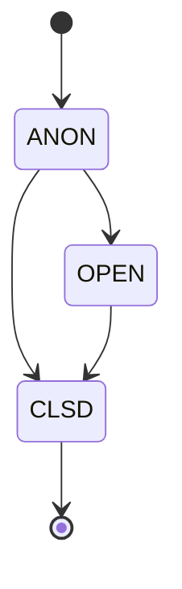
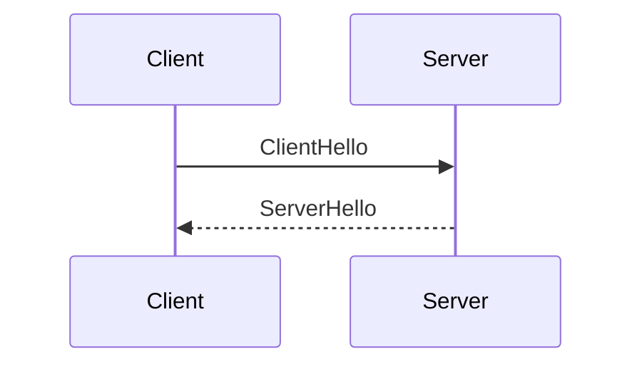
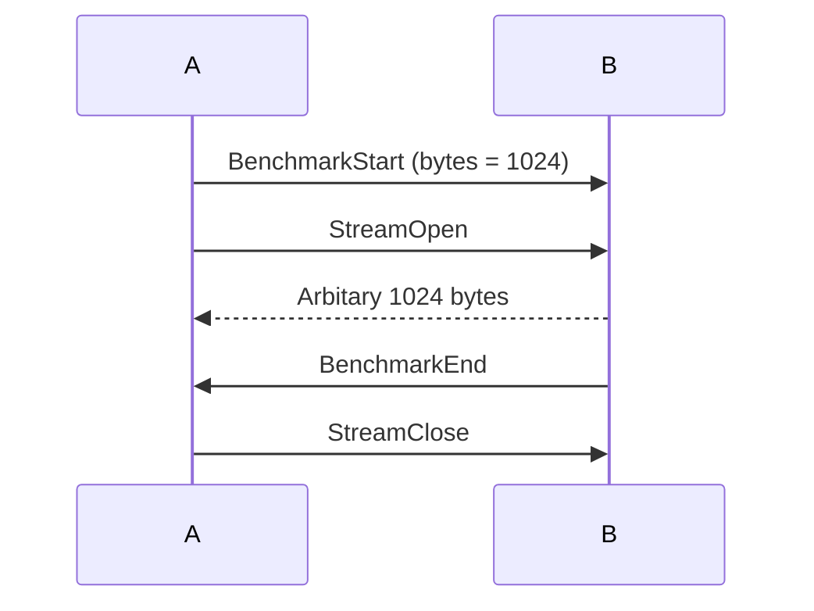

# Protofish

## Credits
Written by MincoMK\
Dedicated to the one who is an author of the name *Protofish*.

## Introduction
Protofish is an intermediate transport layer that abstracts transportation of streams and messages between various zako2 components. Protofish itself does not specify the whole process of data flow, but the guideline to implement Protofish over any upstream protocol.

## Features
Protofish supports various simple essential features. Take a brief look at them.

### Arbitary Messaging
Protofish lets you safely send your own binary data through the connection. For example, you can send a data request via Protofish messaging channel.

### Lossy/Loseless Streaming
Protofish supports both lossy and lossless binary streaming. Once you send a message that notifies open stream, the new independant logical stream is initiated and made it able to send the binary data through it. For example, you can leverage lossy binary stream to send a live audio stream.

### Context Tracking
Protofish make it possible to track request and corresponding multiple responses easily.

# Basic Operational Concept
In this chapter, we're going to deal with the basic operational concept of Protofish.

## Messages and Payloads
Messages and payloads are closely related concepts. It's similar to a REST API. It's used for passing events, simple data, and communicating.

### Payload
Payload is a concept similar to a schema at a REST endpoint. It has a structured data format. It's basically a kind of command that makes peer do something. For example, `StreamOpen`, `SocketClose`.

### Message
Message is an envelope for the payload. It contains one of the possible payloads. It's the final serialization format, which is directly sent to the message channel in Protofish.

> **NOTE** It might confusing to distuingish concept of messages and payloads. You can simply understand the payload as a product, and the message as some kind of cardboard box that encloses the product before shipping.

## Context System
Basically, the message channel is *flat*. Client can try to send multiple messages simultaneously, and it's not possible to identify what message is a response to the other message by itself. Once I send a request A to the server, probably I'd want to track and get corresponding response to A. But as I mentioned, since the channel is *flat*, it doesn't guarantee you that the very next message is the response to the request A. This is exactly the reason why context is needed. As soon as I send a request A, a new context is formed. Also all corresponding responses are belonged to the context. Hence we're able to track the corresponding response.\
Methodologically, we mark every messages with a unique context ID. It makes it possible to track the context.

## Stream Management
Protofish can easily manage multiple parallel binary streams. Streams are identified by their ID. `StreamOpen` and `StreamClose` messages notify the peer the open and close of the stream, respectively. Since they are messages, they also have the ability to track contexts. Therefore, a binary stream can be a response to a request.

## Fault-Tolerance
Protofish provides you a *keepalive* and a *connection resume* mechanism to be fault-tolerant. It can quickly resume all streams after the connection drop.

## Benchmarking
Based on the experience gained with HTTP/WS, we've learned that benchmark monitoring is a crucial part of achieving reduced latency. So Protofish now has the ability to automatically perform various benchmark tests to assess the performance.

# Specification

## Specifications of Requirements
The key words "MUST", "MUST NOT", "REQUIRED", "SHALL", "SHALL NOT", "SHOULD", "SHOULD NOT", "RECOMMENDED", "MAY", and "OPTIONAL" in this document are to be interpreted as described in RFC2119.

## Version Management
Protofish's version system follows [Semantic Versioning](https://semver.org). Also, it follows [Keep a Changelog](https://keepachangelog.com/en/1.1.0/) rule.

## Upstream Transport Protocol (UTP)
Protofish entirly relies on UTP. Therefore, strict prerequisites are applied to UTP. Following list is the prerequisites.
- **Stability** It MUST guarantee full binary integrity for all reliable streams.
- **Non-blocking** The stream SHOULD NOT block nor interfere other streams.
- **Multiplexing** It MUST follow these conditions.
    - It MUST provide a reliable stream, and also an interface to create more isolated streams.
    - It MUST have a mechanism to notify the other side that a new stream is created.
    - It MUST have a way to distuingish a stream by ID, regardless of the reliability of the stream.
In a perspective of functionality, an UTP SHOULD support these operations.
### Stream Open
#### Parameters
- **Reliability** Whether the stream is reliable or not
#### Returns
- **ID** A method to identify the stream, internally

### Stream Close
#### Parameters
- **ID** An identifier of the stream to close

### Send
#### Parameters
- **ID** An identifier of the stream to send
- **Data** A binary data to send

### Receive
#### Parameters
- **ID** An identifier of the stream to receive
#### Returns
- **Data** A binary content received

### Primary Stream
The very first of the UTP MUST be a reliable stream, which is called **primary stream**. Protofish entirely relies on the primary stream to handle all protocol messages.

## The Standard
Protofish is designed to support adaptation to a wide range of UTPs. However, the recommended implementation setup is QUIC-based UTP, which is specially specified as [QUICfish](quicfish.md).

## Summary of Operation
Protofish follows simple operational rules.

### Protofish Finite State Machine (FSM)
This section describes the Protofish operation in terms of a Finite State Machine (FSM).

#### States
Protofish has multiple types of states. This state model is for conceptual representation of Protofish. Therefore, it's not neccesary to exactly follow the model as far as the implementations support the described functionality.



##### ANON
|From|To|Reason|
|-|-|-|
|x|**ANON**|Initial connection|
|**ANON**|**OPEN**|Handshake|
|**ANON**|**CLSD**|Close Packet|
**ANON** (Anonymous) is the initial state of every connection. It doesn't contain any peer info.

##### OPEN
|From|To|Reason|
|-|-|-|
|**ANON**|**OPEN**|Handshake|
|**OPEN**|**CLSD**|Close Packet|
Once the handshake procedure in **ANON** state has been successfully done, it becomes **OPEN**. **OPEN** state contains all session variables, connection info, etc.

##### CLSD
|From|To|Reason|
|-|-|-|
|**ANON**|**CLSD**|Close Packet|
|**OPEN**|**CLSD**|Close Packet|
**CLSD** is the pseudo-state that represents a closed connection. The implementation SHOULD store the CLSD connection handle for an appropriate time to achieve stable resuming if needed.

#### Session Variables
**OPEN** state forms a session. Session MUST store these variables.
- **Connection Token** The connection token acquired from `ServerHello`
- **Context Information** Map from context ID to the list of open stream IDs in the context

## Primary Messaging Channel (PMC)
Primary stream MUST be used for messaging. Messages MUST follow the [framing rules](#framing) to frame the binary content. Only payloads SHOULD transferred through PMC.

### Payload
All [payload](#payload)s are defined at [payloads.proto](protos/payload/payloads.proto).

Following list is the payloads and their explanations.
- **ClientHello** A packet that initializes a handshake
- **ServerHello** A packet that responses to the ClientHello
- **Close** A packet to close the connection
- **OK** Represents the request in the context has been succeeded
- **Error** Represents the request in the context has been failed
- **StreamOpen** A packet that opens a new stream
- **StreamClose** A packet that destroys the existing stream
- **ArbitaryData** A packet to pass any downstream binary message
- **Keepalive** A packet that pings the peer
- **BenchmarkStart** A packet that starts a benchmark
- **BenchmarkEnd** A packet that indicates the end of a benchmark.

### Message
All payloads going through PMC MUST be serialized with the `Message` specification in [message.proto](protos/payload/message.proto). Field `context_id` indicates a context ID, therefore it MUST unique. It is RECOMMENDED to use a simple atomic counter to resolve a next context ID.

### Framing
Message channel is streamed via length delimited frame.
```
[ Length (uint64, Little Endian) | Message (binary) ]
```

## Context ID Pooling
A server and a client SHOULD maintain a counter to store a context ID. To resolve a context ID conflict between them, we reserve the LSB of a context ID to indicate a *direction of the initial message within a context*.
### Context ID Parity Rules
|LSB|Direction|
|-|-|
|`0` (Even)|Client &rarr; Server|
|`1` (Odd)|Server &rarr; Client|

Also, context ID `0` is reserved for handshaking. A initial message of a handshake is `ClientHello`, which is Client &rarr; Server, does satisfy the parity rules. Although it would be rare, but if the ID counter exceed `UINT64_MAX`, it is generally safe to reset a counter to the base value (`1` for a server, `2` for a client).

> **NOTE** The base value of a client counter is `2`, since the first even number `0` is reserved for a handshake.

## Handshake Flow

Protofish uses a common handshake procedure to exchange the informations between a server and a client. It's done in the PMC via messages. Handshake messages MUST belong in context with ID 0, and context with ID 0 SHOULD NOT used for other purpose.

### Client-side Hello
Once an upstream connection is established, a client MUST send `ClientHello` to a server.

### Server-side Hello
Once a server received `ClientHello`, it MUST immediately respond with `ServerHello`. Field `ok` in `ServerHello` MUST be *true* to indicate a successful handshake and continue. It MUST be `false` to indicate a rejection. Payload `Error` MAY follow the rejected `ServerHello`. Field `info` in `ServerHello` must exist if `ok` is *true*.

### State Transition
Once after a successful handshake, both peers SHOULD have a transition to **OPEN** state.

## Closing
Connection SHOULD be closed in following reason.
- **Close Packet** Message `Close` can be sent in order to gracefully close the connection. Both peers MAY erase the state information after a close packet. Gracefully closed connection cannot be resumed.
- **Keepalive Timeout** Keepalive timeout SHOULD be considerd as connection close.

## Resume Connection
### Connection Token
Server MUST provide a unique connection token in a successful `ServerHello`. A connection token SHOULD be a random 32 bytes long data.

### Behavior
Server with accidently closed connection MAY store the client handle with **CLSD** state for a desired time, which is RECOMMENDED to be 15 minutes. Client with accidently closed connection MAY try to reconnect and resume. Resume operation MUST be done by setting a field `resume_connection_token` to the connection token acquired by `ServerHello` in a previous conenction. Server SHOULD revert the **CLSD** state of a resumed client to **OPEN**, and continue transmission.

Server MUST set field `is_resume` under `ServerHello` to indicate that it successfully restored stream information and ready to resume the connection. Client SHOULD resume the connection and continue to stream only if `is_resume` is *true*.

## Keepaliving
Both side MAY send a `Keepalive` message to check a liveness of the peer. Peer MUST immediately send `OK` message to the context of the received `Keepalive` message. Both side MAY choose the frequency of sending a `Keepalive` message and a wait timeout for `OK` message to consider the peer as down. Although it's free to set their own values, but the following is a RECOMMENDED standard.
- Send `Keepalive` every 30 seconds.
- Timeout after waiting 2 seconds.

## Benchmarking
One side, call side A, MAY send `BenchmarkStart` message to start measuring bandwidth. `StreamOpen` SHOULD follow by the side A in the context. The peer B SHOULD send arbitary bytes with a count specified in the field `byte_count` in the `BenchmarkStart` message. Therefore it's possible to measure the bandwidth by measuring the time elapsed. The side B SHOULD send `BenchmarkEnd` in the context after all bytes were sent. And the side A SHOULD close the stream by sending `StreamClose`.

Also, benchmark SHOULD be interrupted if early `StreamClose` is received.

## Error Handling
Both sides SHOULD send `Error` message to notify the peer that an error has been occurred. Also, `Close` message MAY followed to close the connection due to a critial error.

## Security Considerations
A native Protofish implementation is abstract. Therefore it has no need to implement security features. However, UTP MAY support modern authentication system like mTLS.

# Conclusion
This document comprehensively explained the operation of a simple protocol, Protofish.
